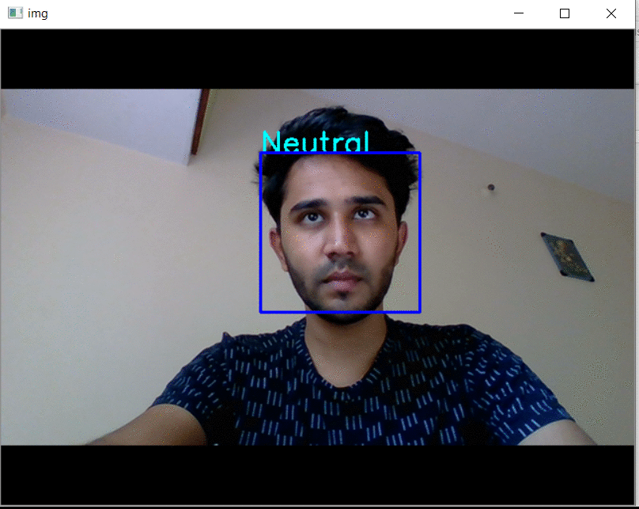
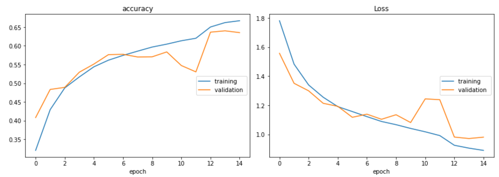

# facial_expression_recognition
Recognize 7 distinct facial expressions real-time using keras and openCV

## Procedure to Execute:

--Unzip the dataset.zip file to the root directory of this project. 

--Run 'train_model.ipynb' file to build a CNN model and train it using the dataset. It also saves the model in model.json file and saves the weights in model_weights.h5 file.

--Run 'test_real_time.ipynb' file on your PC for real time expression recognition. The file uses my pre-trained weights by default saved in the saved_model directory. The pretrained weights give 70% accuracy on the training dataset and 60% accuracy on the test dataset(15 epochs). I recommend loading the saved weights and training the model firther for improved accuracy. 

## Sample Output:

## Accuracy and Loss while training:

## Dataset:

It contains the below given set of images for training and testing

Train:

3995 angry images

436 disgust images

4097 fear images

7214 happy images

4965 neutral images

4830 sad images

3171 surprise images

Test:

958 angry images

111 disgust images

1024 fear images

1774 happy images

1233 neutral images

1247 sad images

831 surprise images

## Accuracy Obtained for each Expression(percentage):

{'angry': 63.05381727158949,

 'disgust': 67.66055045871559,
 
 'fear': 39.956065413717354,
 
 'happy': 89.64513446077072,
 
 'neutral': 69.66767371601208,
 
 'sad': 73.6024844720497,
 
 'surprise': 85.20971302428256}

